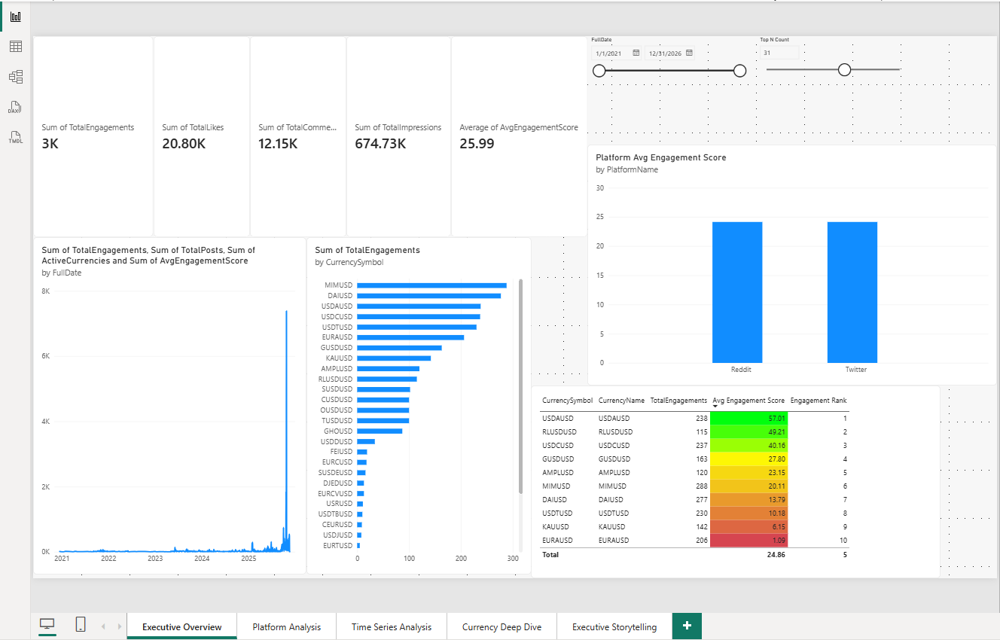

# NoodlesCrypto Analytics Platform

## Project Links

- **Public GitHub Repository:** [NoodlesCrypto Top Performers Submission](https://github.com/reecegow336-wq/NoodlesCrypto_TopPerformers_Submission)
- **Demo Video:** [Watch the NoodlesCrypto Power BI Demo](https://www.loom.com/share/bc83a1c640974d06a5432e84504fc1e8)

---

## Project Overview

NoodlesCrypto is an end-to-end cryptocurrency and social-engagement analytics solution built using Python, pandas, MySQL, SQLAlchemy, SQL analytical views, DAX, and Power BI.

The project transforms raw JSON source data into a structured analytics warehouse and interactive business-intelligence dashboards.

The solution covers:

- Data extraction and transformation
- Data cleaning and validation
- MySQL data warehousing
- Star-schema modelling
- Aggregation tables
- SQL analytical views
- Power BI semantic modelling
- DAX measures and time intelligence
- Interactive dashboards
- Executive-level reporting and storytelling

---

## Dashboard Preview



---

## Business Objective

The objective of this project is to convert cryptocurrency and social-media engagement data into structured, reusable, and decision-ready insights.

The solution enables users to analyse:

- Overall engagement performance
- Token performance
- Reddit vs Twitter engagement
- Historical engagement trends
- Currency-level performance
- Top-performing tokens
- Executive-level insights

---

## Architecture

The end-to-end analytics pipeline follows this structure:

```text
JSON Source Files
        ↓
Python ETL / pandas
        ↓
Data Cleaning & Validation
        ↓
MySQL noodles_dw
        ↓
Star Schema
        ↓
Python Aggregation Layer
        ↓
SQL Analytical Views
        ↓
Power BI Semantic Model
        ↓
Interactive Power BI Dashboards